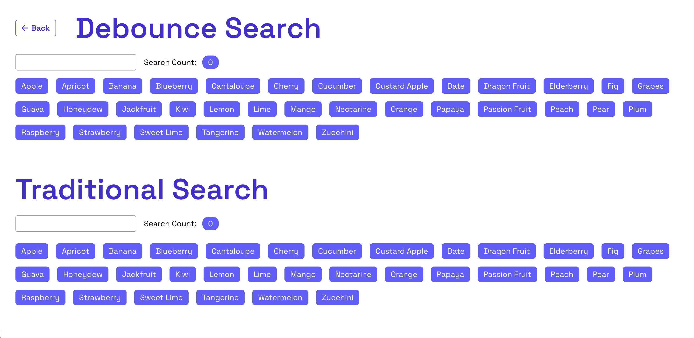

# 💪 React Projects


## 🚀 Live Demo

No installation needed – it's 100% online!

Try it out here 👉 [React Projects by Faraaz Ansari](https://thefaraazansari.github.io/react-practice/)

## 📸 Screenshots

1. Infinite Scroll


2. Debounce Search vs Traditional Search



## ⚙️ Installation

Follow these steps to run the project locally:

To install node_modules and all necessary dependencies

```bash
pnpm i
```

To start the development server

```bash
pnpm dev
```

Open `[http://localhost:3000]` to view it in your browser.

## 📁 Workflow File

The deployment configuration is located at:

```bash
.github/workflows/deploy.yml
```

No manual deployment needed — just push to `main` branch 🚀

## ⚡️ Deployment (GitHub Pages)

This project uses GitHub Actions to automatically build and deploy the Vite app to GitHub Pages.

How this works:

- Every push to the `main` branch triggers the deployment workflow
- The project is built using Vite
- The production build is generated in the dist folder
- The build is automatically deployed to GitHub Pages

---
 
Made with ❤️ by **Faraaz Ansari**
